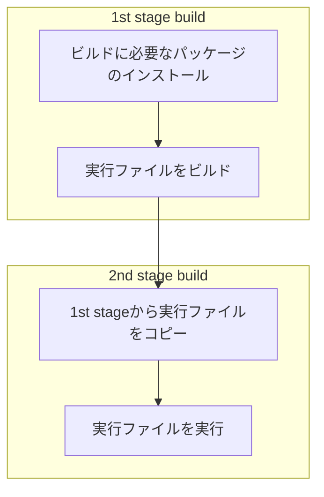

## はじめに

Docker を使う際に、image のサイズが肥大化していくことで、ビルドした image のアップロードやデプロイ時の image のダウンロードに時間がかかってしまいます。

対策として、軽量なベースイメージを使用する、Dockerfile でインストールしている中で不要なパッケージを探し削除する、などの方法が挙げられます。今回はその対策の 1 つとして、マルチステージビルドという方法を紹介します。

## マルチステージビルドとは

マルチステージビルドとは、段階を分けて image のビルドを行うことができる機能です。各段階では異なるベースイメージを指定でき、各段階の任意の成果物を以降のビルド段階にコピーできます。最終的な image として採用されるのは最後の段階のみとなります。

例えば、以下の図のように 1 段階目のビルドでは、実行ファイルのビルドに必要なパッケージのインストールを行い、実行ファイルをビルドします。2 段階目の最終的な image ではその実行ファイルのみを 1 段階目の image からコピーし、実行するだけというように、アプリケーションのビルドと実行をそれぞれ分けることができます。



そのため、実行ファイルのビルドのためだけに必要なパッケージは、実行するための最終 image でインストールせずに済み、最終的な image の容量を軽量化できます。

その他詳細については、以下のドキュメントをご覧ください。

https://docs.docker.com/build/building/multi-stage/

## Dockerfile の実装

ここからは実際のアプリケーションを使って、具体的なマルチステージビルドの書き方について見ていきます。
今回は 以下の Go アプリケーションを対象に紹介します。

https://github.com/gothinkster/golang-gin-realworld-example-app

まず、プロジェクトのルートに以下のような Dockerfile を作成します。

```Dockerfile
# syntax=docker/dockerfile:1

# 実行ファイル作成用のビルドステージ
FROM golang:1.20-alpine3.17 AS builder

# SQLite 接続に使用するためインストール
RUN apk update && apk add --no-cache gcc musl-dev sqlite-dev

WORKDIR /app

COPY go.mod go.sum hello.go doc.go ./
COPY common ./common
COPY users ./users
COPY articles ./articles

RUN go mod download

RUN GOOS=linux go build -o ./realworld

# 最終的な image のビルドステージ
FROM alpine:3.17

WORKDIR /app

# ビルド用の image から実行ファイルをコピー
COPY --from=builder /app/realworld .

EXPOSE 8080

CMD [ "./realworld" ]
```

通常の Dockerfile では一度しか書かない`FROM` が 2 回書かれていますね。このように、`FROM` ごとに新しいビルドステージが展開されます。

この Dockerfile では最初に、以下のようにビルド用の image を指定しています。`AS` で指定した名前は、エイリアスとして後のビルド段階で使用できます。

```Dockerfile
FROM golang:1.20-alpine3.17 AS builder
```

このビルド段階では、必要なパッケージやファイルを入れていますが、最終的な実行用 image には以下でビルドしている実行ファイルのみが必要となります。

```Dockerfile
RUN GOOS=linux go build -o ./realworld
```

そのため以下の最終的な image ビルドの `COPY` にて実行しているように、ビルド用の image から実行ファイルをコピーします。`--from` で指定した名前は、先ほどの `AS` で指定した名前を指定します。それ以外のパッケージをインストールする必要もありませんし、Go のコンパイラも不要となるため、単なる `alpine` をベースイメージとして使用しています。

```Dockerfile
FROM alpine:3.17

WORKDIR /app

# ビルド用の image から実行ファイルをコピー
COPY --from=builder /app/realworld .

EXPOSE 8080

CMD [ "./realworld" ]
```

## image ビルドの実行

通常の image ビルドコマンドを実行します。
実行ログで `builder` となっているのが 1 つ目のビルドステージ(名称を指定しなかった場合は、`stage-0`)、`stage-1` となっているのが、2 つ目のビルドステージです。

```bash
docker build -t multi-realworld-app .

...
=> [builder 1/9] FROM docker.io/library/golang:1.20-alpine3.17@sha256:08e9c086194875334d606765bd60a  0.0s
 => [stage-1 1/3] FROM docker.io/library/alpine:3.17@sha256:124c7d2707904eea7431fffe91522a01e5a861a624ee31d  0.0s
 => [builder 2/9] RUN apk update && apk add --no-cache gcc musl-dev sqlite-dev                               6.1s
 => CACHED [stage-1 2/3] WORKDIR /app                                                                        0.0s
 => [builder 3/9] WORKDIR /app                                                                               0.0s
 => [builder 4/9] COPY go.mod go.sum hello.go doc.go ./                                                      0.0s
 => [builder 5/9] COPY common ./common                                                                       0.0s
 => [builder 6/9] COPY users ./users                                                                         0.0s
 => [builder 7/9] COPY articles ./articles                                                                   0.0s
 => [builder 8/9] RUN go mod download                                                                        6.8s
 => [builder 9/9] RUN GOOS=linux go build -o ./realworld                                                   100.1s
 => [stage-1 3/3] COPY --from=builder /app/realworld .                                                       0.1s
 => exporting to image                                                                                       0.2s
 => => exporting layers                                                                                      0.1s
 => => writing image sha256:5d709da8056bae932719b36a83c8410bf37701d47c9a2e4c7a7e2e015d6cd7a7                 0.0s
 => => naming to docker.io/library/multi-realworld-app
```

## マルチステージビルドを行わない場合との比較

比較のために、マルチステージビルドを行わない場合の image も作成して、それぞれ見てみましょう。

```Dockerfile
# syntax=docker/dockerfile:1
FROM golang:1.20-alpine3.17 AS builder

RUN apk update && apk add --no-cache gcc musl-dev sqlite-dev

WORKDIR /app

COPY go.mod go.sum hello.go doc.go ./
COPY common ./common
COPY users ./users
COPY articles ./articles

RUN go mod download

RUN GOOS=linux go build -o ./realworld

EXPOSE 8080

CMD [ "./realworld" ]
```

```bash
docker build -t realworld-app .
```

```bash
docker images -f=reference='*realworld-app'
REPOSITORY            TAG       IMAGE ID       CREATED          SIZE
multi-realworld-app   latest    8fce08972641   3 minutes ago   26.2MB
realworld-app         latest    5a3c44f4214b   3 minutes ago   729MB
```

マルチステージビルドを使った image が 26.2MB なのに対し、マルチステージビルドを使わない image が 729MB となっていますね。

## まとめ

このようにマルチステージビルドを使うことで、image の容量を軽量化できます。
ぜひマルチステージビルドを活用してみてください。
